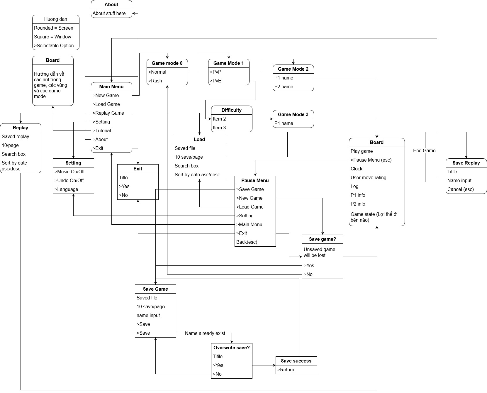

# CaroGame

### Đồ án cờ caro. GVHD: Trương Toàn Thịnh.

### Thành Viên:

1. Nguyễn Quang Thông
1. Nguyễn Anh Vũ
1. Võ Nhật Phước
1. Hoàng Trung Nguyên

# Features

## Backend

1. Capture game log:
   - Text file
1. Save/Load:
   - Save and load game log
   - Check savefile when load, detect edited file
   - Ask to overwrite when 2 save has same name
1. Music
   - Find chill music
1. Multilevel AI
   - 2 - 3 level indicate with different colors. Green -> Red
1. Multilevel Undo
   - Using log
1. Replay

## Frontend

1. Description for selection
1. Keymap in all screen
1. Shortcut for selection (Underline the distinc character)
1. Search save file
1. Sort save file by date desc

## Game

1. Game Mode (Available for both PvP and PvE):
   1. Normal Mode
   1. Rush Mode (Has time constraint, can be adjusted)
1. PvP
   - Ask for 2 player name
1. PvE
   - Ask for player name
   - Ask for difficulties

## Screens

1. Main menu
   - Logo
   - New Game
   - Load
   - Settings
   - Tutorial
   - About
     - Members (ID, Full name)
     - Source code link
   - Exit
1. New Game
1. Load
1. Setting
1. Tutorial
1. About
   - Members (ID, Full name)
   - Source code link
1. Esc Menu:
   - New Game (Ask to save current game)
   - Load (Ask to save current game)
   - Save (Ask to save current game)
   - Settings
   - Tutorial (Ask to save current game)
   - About
     - Members (ID, Full name)
     - Source code link
   - Exit
1. Game Mode Screens
