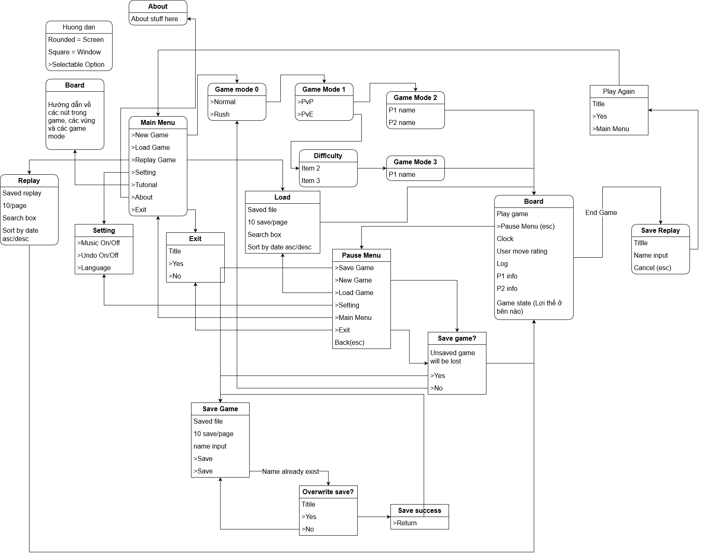

# CaroGame

### Đồ án cờ caro. GVHD: Trương Toàn Thịnh.

### Thành Viên:

1. Nguyễn Quang Thông
1. Nguyễn Anh Vũ
1. Võ Nhật Phước
1. Hoàng Trung Nguyên

# Features

## [Link to Diagram](https://viewer.diagrams.net/?highlight=0000ff&nav=1&title=CaroGame.drawio#R7V1dc6M4Fv01rpp98BTCxh%2BPtpN0z1SSycTdO5N%2B2cIg23Rj5AGc2PPrVwKJGEs26sQgiFXVVW2EIEI6ujr3SLpqdSar7afQXi%2FvkAv9lmm421bnqmWa5mA4xP%2BRlB1NMfudNGURem6aBl4Tpt6%2FkCYaNHXjuTDKZYwR8mNvnU90UBBAJ86l2WGIXvLZ5sjP%2F9W1vYBcwtSxfT71L8%2BNl2nqwDJe0z9Db7FkfxkY9M7KZplpQrS0XfSyl9S5bnUmIUJx%2Bmu1nUCf1B6rl%2FS5myN3s4KFMIhlHnj67cnbXn2DUX826oS37e9Xv4%2Fb9C3Ptr%2BhH9wyez5%2B39j1nvHPBfnJkmYs4c72AvzUHQw27B7%2Bu7PD%2FDgt95akFuIdq9roxVv5doCvxnMUxFN6x8DXztLz3Vt7hzbk06LYdn6wq%2FEShd6%2FOL%2Ft41sAJ%2BDbYUyR0zFyOabkSfrOEEY4zwOrL3CQdGdvcxlv7ShmpUG%2Bb68jb5aUjzy4ssOFF4xRHKMVzfSy9GI4XdsOyfOCewMpSLxihQzRJnChS68Wvh1F9MEMF%2BTCt2fQH6PQheEE%2BSjEyQFKqii9gz9nkbzq4O4KPduvxUu%2BYP8axXa8d417Kdy%2Fhq63f%2Bkj50dS1PTjk461d5sHHkMRDGO43UuiQPwE0QrG4Q5noXe7tE8wq0AvX157GGBZlnu9K3vOpr16kb35Ffj4B8X%2BT%2FQDU9QP7BVpxAS89%2FAF3%2F5kryAHY%2FzJcYLCEP2AB80y93z%2FIMn2vUWAL304J4%2BROvOwuRnR5JXnuuTN4whDyQsWt0m2q%2B5ryiOtD5KE8ONzP0HPEj8I8RvGa%2BQFcVI%2F1hj%2FwzU2MX61WhYu6wRfg9dr%2FI9kD%2BMJCnDxcacm74UY%2BC%2BQgD%2BHGwmM88A4aXOK0ULh0ZGER%2BcM6NgMXhbxAH39nzP53f6Gv2331BNbyT103CLbzeCR2j7cWEEOJ71%2FNsTSp3XYjtJKHJH6CmFqM2mGPSvaMjvDvD1NX3vEoGoklo3EXoVIFJa4U4DER7j27Z02VaoAMlQNkG4BQKYwjnHLaDP1kVEIZAnVOWD45%2B7P6HZ6bd48%2Fh1%2FCybXm%2BunSeGI%2BWUTY5KOKbzG4UfGoaUah0W8fjQjTqVGRuXIGKhGRhGTut56GhjVAyMT%2FpQBYyACRl7%2FSrEhEr60xMV0o5ysldO7cp3HhXN7k1QkqaAbe%2BX5BAmfof8MSWdhNZd%2BOzDpteDxve73msrD9Ke1KsCQlqkRkgjNWNjZITrkIPrFi33t7x3HpghDR8EmA6OTpqOWypaYpxsFw%2BATjDSsmgarKmUqMayK%2FL97pFHVNFRVqW2JUcV7c583iIhZhkv8fE2%2B2PzihyFfbdDLs6%2B20EHoVUq%2FAO87PtLqx3%2BTXBtTJ4SQh6S2cdXauMxivIuRidBVnpHjFfzpPxv8oRm2%2FvIC0rk1tpqGLREtqxZbvQJaNoU%2BW%2BthGn%2BsYw9pG9Y8nImIWrU463Ooge4CMgaGW2CJFiiw%2FevX1AP56DXPLUJrWuHfYRzvaI3bmxjxzfEODsPRvKP0JUKb0IEnvp%2FyA%2FzCBZSg4KRuTrZrCH079p5hrhTnbzUJ5ZPOl2jp8yLYd%2FeQe8sKC73SLAsvfVJIYuxt5vOkHKFWQpUPWs2TQk3hjGDe%2FB2sntEG8IPP%2FbSHeQtoyk5blyc%2BmEUrvO42kecQ%2Bo6p%2B80fxCRqW6jUFmaGpUG20CoA2dfARRpjTcaY8jkis0iMuLWDxYZsz9Lgahq4lE8VmQMVCgSuxnD3N3keNze9fKKvSy6utrmrHb1SolycWj5eqFwwSNREumC0TDf30eYWN%2BNQsr17w1q1t8nLAJyvlm7K0o7aRThqHfPAURMt0huIHDWrrCGIjW37E3n2czJHjKtBsxrlrGYoDbITbpkIU%2BWtWeeXVZHVEEaEcYVfuNZkuYmwEnli1cLK5GA1hXboLHHaDG01pBoHKZH%2FVS2keDF9iqudAIoU07VjmPxZh8QIgeQ%2FjbGGYUy4ybRakHW11%2FcWJ192eYJZL6evIxSl807fGNmh9vouZX0Cvzq4Lzs%2F1y%2FNKPGy9ufWpNfCQ8Y1aI3HreE4XbGeXI5aozHZ%2BP5Mbw7wBxtOa9JpjQCZxAvIz%2FGIDJy4bZIHF0lkj0k%2B33OSb5hkSH6PjHyG9CljhVztIqgeazNDdvYJQXCOAFniMg9VjLX1UUqB5JjJ2rYmY2ZPz4O8qblZPyps72692puV%2BxRHSkNDGXfJUGCA7H4oiN%2Bo%2BdNH5k%2FdwwWesosChmUNM92ijaMPzw%2BavyjmL5mRac6Cpi4vcR7i6lrjqnG4Ur6Iqa%2F51dv4lSXJr2q28KAroUHl%2BZWp%2BdXF8qveoTzVVc6veHXqgUhOgQ4XW4PxrzRdqDxe1efxZGo8NRVPyvmU1dN86i18ypLVJ1lr1oRPsXJL8Kl06oKs69N86kL5VGZ3aqNXWUW6wj0KVyTMtR4KlQ6FljzW6kKtrMKzHjbRUgOrccBSz7EszbHesmzKlKRYDBI1oVj9C5%2B5twaS7VYzqdE6Ho7n1Nl8efWxo8%2Fnu2jGfKhAAmDJjT6lRfCx%2BK17WoGsDZtpXtie3oXHmutJ05J6RZtj5T6l%2FFx587nn4CrbaYnnQgasrnUwYMmetlGaxNPjAy79FsNVOrWrxyul41VmRBo0XvErCCicOhpOjYOTcjGnp2TCrD70hy3sK%2Fbuu6roj%2FBIaZMfPGoswr2DngoizIjP2FZGT8Xtw6vv14HbOnKwMin0rT2Dfr66mUF2cLXB8JRJTijinjnMW9orYROcxBVnwkzDQUHAorsn6cZJJtY2fjW7LEgbNXe0D0k3AX35A%2FmavSxoPo9gzLVRVoZ3mEOJwEB6j%2BglORTDw8hAovNjhsIhu7RFw%2FwmnYf01PaFFsFqwALPEhhIDKmyEFW4bcbeRMm0AAw2%2BL9fYOT8RwOtcUATuRvVAo1X7SY%2BwiOYxlLTsCSKEVQtlniK%2FTXCNJks9SPxzIzQToPta2g1DFrC0EDVYosXbW%2BRhlIDoWQphxIv2CYT1l4w14fYNhBQoiM8qgWUYA%2BWqQHVVED9hKBQFqD4TVh0FVgUp4EWf7ml8aVGHY%2BIsUsafGp8g69YXCrye5ZEjBqRkFRBGkYKaT%2BxgZgUbTQVYbK0ZV4DiY09eVFC7%2Bq50Njt1sGuno7sLmmztGhnA17mODgoN4m4LZ4M0uaxWvM4kEdcXRaBDIr29tzDFw2vpsJL%2BaKQQdEZgenZKBpfzcSX8tO1BkXHA2bnpGpsNQxbQum2WnAVnQt4hys%2F8xo0wJoGMJGgWy3AeLkkD7DrrRdrZDUPWbKHM5eHLH7L5th2fujVFs0ElFDZrRZQF753m5nqwtXd9drbxgj6KfEzpyBp7fNCtc9MlKcmpy9rcrLB7vzg5ZV7fW5ljcaxzLg0R%2B4c8nK6Prey8bBSLnMOeRU9jSJheMF6o1245kFKubI5LBKfUtqmgdUwYKmXNYFRtEdDQ6uZ0FIuaA6Fgmbe3fwDf9BL6CWrwRLa1bnRbufFup2HUVaG0m6nWRqIee30ixdrh7MGJrEvDa%2FaOJzCbeB7Y%2B0TjDSuGocr5R5nFo3qRLxvjavG4Uq52wkEscRqHA6mPhNEmVdVOEPEUFGTKSJg8Guo7lPxyvZDaLukKHDrRbyMVUGwmWo6aob6swSrASbbUFzf8DTAuPBwXWxhfXF3NerVXZmDdLEN15VsOLNeUdQBABfecLInbbKIZ7VpuAsP7Mz2iBQ2HAB1azl9KO7byCyQ7au1Gx0lwu7RBU%2FRxnFgFGnxudhd%2FqDic4%2FFv2Pet6X6TIpM1T5%2B1haMN2HAwVFLO9VKO6%2BGpjlaNDD5wN4XRWSYGC9BZGrmO5hKTkqrT8tlcnfjCImpzxF%2BW4ub6lo8eXQUhkkkXJaBjmi8WEeNf%2F9gJnswtPbRU5i%2FR7%2FjWH6zdzI%2F%2FpGW%2BLwyoanEg6oPDFk82%2BJ9H6Bedqdz4WoTAD3JlqvZKZmgo2QGrj4tNxA0nPAY1Lq124eQCZMEPJIk7hz1Ft%2FTC2W1Q3VnnooPAVEyyyJV0cLyqqvmN5Gltmnk2Qww%2BqfpDzCYJnnkiXcToFP1ekpOfITr5MwELRoeEw1PQltermubB3odkF2GBdiDZ7cTfHwjtkUxpLDQQt0RfPCIONkDa6mzCUvMr6cho4neXKgGDlUu1RSWmN%2FINYV26Cxx2gxtNSIqR0SViyyFJeZ3yUxxrRE8kFK6aaRkO3Lwy11I%2FtMQqRgi0rv0rLIwokR3k%2FI%2FxGt2JP0PdRMrwlpWEtVGqpaFiofAyzuF97ooI0DCi6KLMpJz5%2FSOwAtelNE%2FmOewZINwg3PY4iMA5t28r0FEHb30qERcvORFM%2FLbR4LV8nrUrnqJRmmuY3nrf0BRQFu9X7CRyFK%2FsQsUBRTRGwabCKxK44mIp0qUzFe%2B3VWRDuWocDn7%2FTo0jPbs9sv33Vf4X%2FPxsT3btpWsARPWwNvmqNhq%2FP2KF36okikp0AV54slOfyl1fgnwwSaOuUb5eSbtGVU48wTMg8VapmyE57OEKREjh9%2Fp8MWLfR2m5P1yYdYpmzPnJNg3cK8jECrFhPKJp8zO7R2RbgcOJA%2FqSPCKUFGlIygkV0rWo7%2BNRR4nh7KrAysnkaaZJwptkGeR%2FBPg9APvpp2nKnH%2F4N%2BEWxqjRXKmzSWzxyM9WoDW43wRHPDFtuzOwrPwRWGTm0K6qNniO4HwMw6sArIoLF7RmY9aY1YBiyr5orB4RWc16uPOVMKjROKIL0OE4n2KgT9reYdcEtrr%2Bv8%3D)

## Backend

1. Capture game log:
   - Text file
1. Save/Load:
   - Save and load game log
   - Check savefile when load, detect edited file
   - Ask to overwrite when 2 save has same name
1. Music
   - Find chill music
1. Multilevel AI
   - 2 - 3 level indicate with different colors. Green -> Red
1. Multilevel Undo
   - Using log
1. Replay

## Frontend

1. Description for selection
1. Keymap in all screen
1. Shortcut for selection (Underline the distinc character)
1. Search save file
1. Sort save file by date desc

## Game

1. Game Mode (Available for both PvP and PvE):
   1. Normal Mode
   1. Rush Mode (Has time constraint, can be adjusted)
1. PvP
   - Ask for 2 player name
1. PvE
   - Ask for player name
   - Ask for difficulties

## Screens

1. Main menu
   - Logo
   - New Game
   - Load
   - Settings
   - Tutorial
   - About
     - Members (ID, Full name)
     - Source code link
   - Exit
1. New Game
1. Load
1. Setting
1. Tutorial
1. About
   - Members (ID, Full name)
   - Source code link
1. Esc Menu:
   - New Game (Ask to save current game)
   - Load (Ask to save current game)
   - Save (Ask to save current game)
   - Settings
   - Tutorial (Ask to save current game)
   - About
     - Members (ID, Full name)
     - Source code link
   - Exit
1. Game Mode Screens
